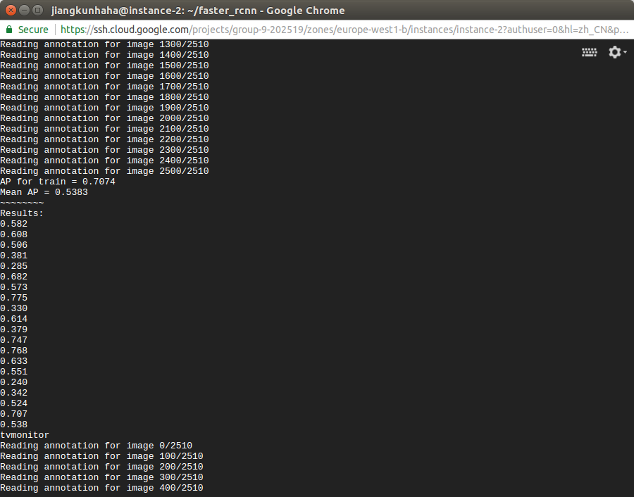
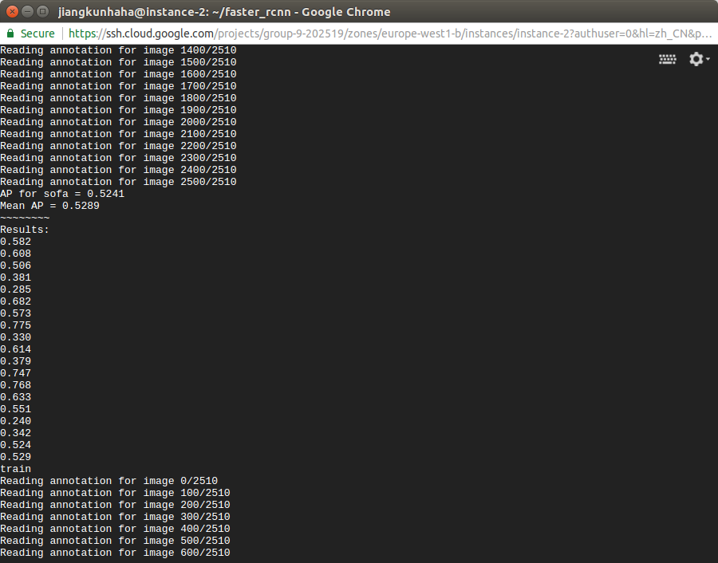

## 实验结果  
为了提前看下最后的结果，我把  
```yml
    parser.add_argument('--phases', dest='phases',
                        help='Training phases, e.g. 60000:0.001,20000:0.0001 for'
                        '60k iterations with learning rate 0.001'
                        'followed by 20k iterations with learning rate 0.0001',
                        default="60000:1e-3,20000:1e-4")
```  

这部分都调成了10000次。经过四次在VOC2007的`train.txt`的训练和在`val.txt`的预测以及跟真实情况的对比。预测实验结果见文件[car](comp3_det_test_car.txt)和[person](comp3_det_test_person.txt)。这两个txt文件最左侧是验证数据图的编号，中间是属于这个物体的可能性，右边是定位框的坐标。而与真实情况对比以及mAP可见图。  
  

  

这些都只是部分结果，GCP似乎真的没有gui，我连`gedit`和`display`的命令在里面都用不了，然后程序也似乎没有显示*定位框*那种程序，所以只用这样的结果，不过我也没怎么深入理解，看看谁代码解读能力强的看看能不能把结果放到图片上框出来。又或者是因为没有gui的原因所以没显示，我也不清楚。
